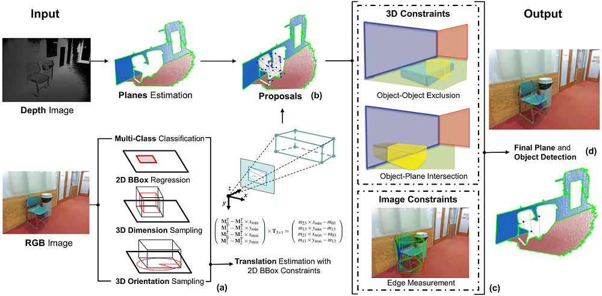
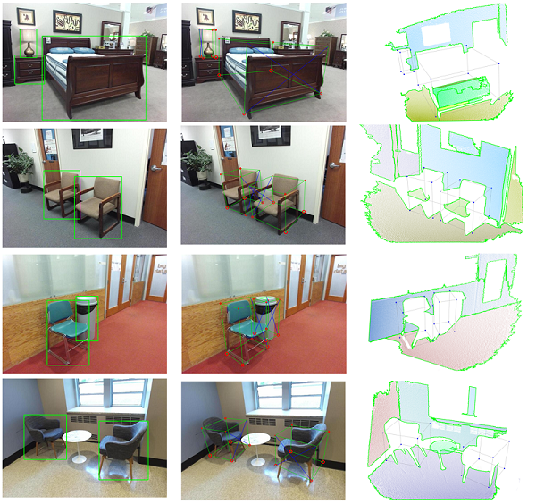

# Monocular Object Detection - Sample-Score Method

**Related Paper:**  

+ Benchun Zhou, Maximilian Gilles, Yongqi Meng. **Structure SLAM with Points, Planes, and Objects**[J]//Advanced Robotics 36.20 (2022): 1060-1075. [[**Link**](https://www.tandfonline.com/doi/full/10.1080/01691864.2022.2123253)] [[**PDF**](./README_Picture/2022_Advanced_Robotics_Publication.pdf)]  [[**Slide**](./README_Picture/2022_Advanced_Robotics_Slide.pdf)]
 [[**Youtube**](https://youtu.be/nBbGTFeUh88)] [[**Bilibili**](https://www.bilibili.com/video/BV1JM4y167uT)]

+ If you use the code in your academic work, please cite the above paper. 

<div align=center></div>
<div align=center></div>

Taking RGB images as input, the sample-score method employs a 2D object detector to get object classes and 2D bounding boxes. For each bounding box, we sample the dimension and rotation of the object to generate many cuboid candidates. These candidates are scored by 3D and 2D constraints, and the best candidate with the highest score is selected as the representation of the object.


## 1. Prerequisites 
* Ubuntu (18.04.5)
* CMake (3.10.2)
* Eigen (3)
* OpenCV (3.2.0)
* PCL (1.8.1)

## 2. Running
Clone the repository:
```
    git clone https://github.com/benchun123/monocular_object_detection.git
```
build the project: 
```
    cd monocular_object_detection
    mkdir build
    cd build
    cmake ..
    make -j4
```

## 3. Thirdparty
Maybe you need to rebuild the library in the folder /Thirdparty, use the following instruction: 
```
    cd Thirdparty/line_lbd
    mkdir build
    cd build
    cmake ..
    make -j4
```

```
    cd Thirdparty/tictoc_profiler
    mkdir build
    cd build
    cmake ..
    make -j4
```

## 4. Run it as follows:
```
    ./det_rgbd_opti_sun_node  ~/path/to/sunrgbd_dataset
```
A small dataset from SUN RGB-D dataset can be found [here](https://drive.google.com/file/d/14PQWSmCsBvmomllWeF4_hlDiEuYIyWgQ/view?usp=drive_link). 


## 5. Acknowledgement 

Thanks for the great work: [**Deep3DBox**](https://github.com/skhadem/3D-BoundingBox), [**Cube SLAM**](https://github.com/shichaoy/cube_slam), and **RoomLayout**

+ Mousavian, A., Anguelov, D., Flynn, J., & Kosecka, J. **3D Bounding Box Estimation Using Deep Learning and Geometry**[C]. In Proceedings of the IEEE conference on Computer Vision and Pattern Recognition, 2017. [[**PDF**](https://openaccess.thecvf.com/content_cvpr_2017/html/Mousavian_3D_Bounding_Box_CVPR_2017_paper.html)], [[**Code**](https://github.com/skhadem/3D-BoundingBox)]
+ Yang S, Scherer S. **Cubeslam: Monocular 3-d object slam**[J]. IEEE Transactions on Robotics, 2019, 35(4): 925-938. [[**PDF**](https://arxiv.org/abs/1806.00557)], [[**Code**](https://github.com/shichaoy/cube_slam)]
+ Gupta, A., Hebert, M., Kanade, T., & Blei, D. **Estimating spatial layout of rooms using volumetric reasoning about objects and surfaces.**[J].  Advances in neural information processing systems, 2010. [[**PDF**](https://proceedings.neurips.cc/paper/2010/hash/076a0c97d09cf1a0ec3e19c7f2529f2b-Abstract.html)], 